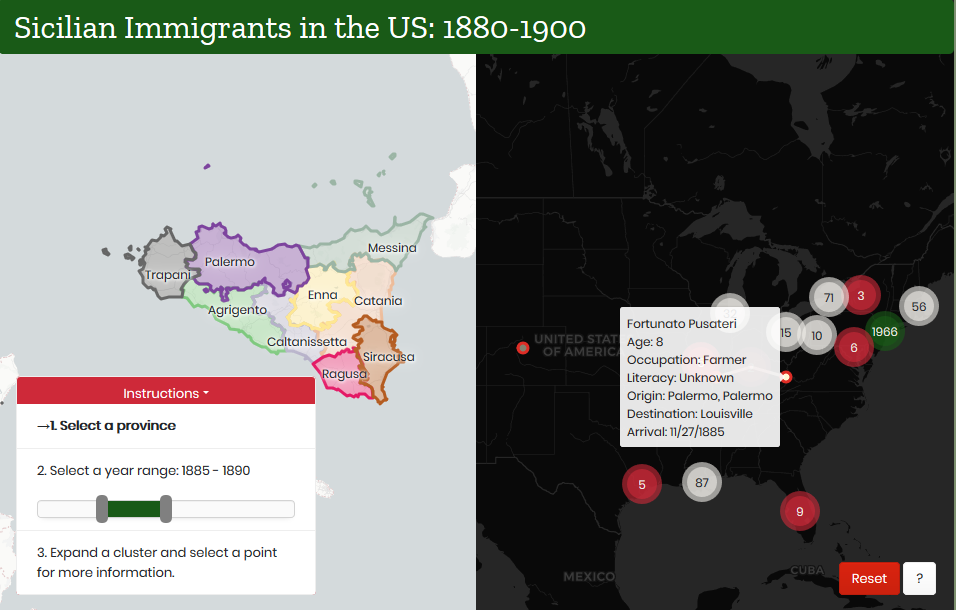

# Sicilian Immigrants in the US (1880-1900)

## I. Introduction

This geospatial data project and map explores Sicilian immigration to the United States in the late 19th-early 20th century.

New York City was a major port of entry for most of US history, with [Castle Garden](https://www.nps.gov/cacl/index.htm), the country's first immigration center, serving from 1855 to 1890. It was replaced by [Ellis Island](https://www.nps.gov/elis/index.htm), which was the main immigrant processing station for the United States from 1892 to 1954. My great-grandfather landed in New York three times (1905, 1912, and 1922)! The ship manifests have lists of passengers, as well as other items such as age, sex, marital status, occupation, and destination depending on the year.

The following examples are drawn from primary historical data including passenger lists of vessels arriving at New York from 1820 to 1897, indexes of passenger lists of vessels arriving in New York from 1820 to 1846, NARA publications M261 and M237 / United States, and Immigration and Naturalization Service, accessed via familysearch.org.  

  
**Figure 01.** Manifest Example 1870.  

  
**Figure 02.** Manifest Example 1892.   

  
**Figure 03.** Manifest Example 1905.  

My maternal grandmother’s parents were born in Augusta, Sicily, a town on the eastern coast near Syracuse. Like all of Sicily, many people left during this time period in search of a better life. This project provides a map interface for visualizing where those who left Augusta, and Sicily more broadly, settled in the United States.  

Users can gain understanding of the history of immigration to the United States by exploring a small slice of that story.

## II. Methodology

### Data

**Data Sources**

- [Italians to America Passenger Data File, 1855 - 1900](https://aad.archives.gov/aad/series-description.jsp?s=4433&cat=GP44&bc=,sl&col=1002) The National Archives has a database of Italian immigrants from transcribed passenger manifests with some demographic data and the passenger's previous residence and final destination.
- Wikipedia publishes a [List of the communes in Sicily](https://en.wikipedia.org/wiki/List_of_communes_of_Sicily).
- Province boundaries for Italy derived from http://www.diva-gis.org/ (modern-day province boundaries).

**Tools**  
+ Python
  + Jupyter Notebook
  + BeautifulSoup
  + Pandas
  + Geocoder
+ QGIS

**Wrangling and analysis process**
+ I scraped the passenger and manifest header data using the process documented in Jupyter notebook (see [data/NARA_scraper.ipynb](project-files/NARA_scraper.ipynb)), resulting in four passenger data files
  + [italians_parta.csv](project-files/italians_parta.csv),
  + [italians_partb.csv](project-files/italians_partb.csv),
  + [italans_partc.csv](project-files/italians_partc.csv), and
  + [manifest_list_1855_1900.csv](project-files/manifest_list_1855_1900.csv).  
+ In the jupyter notebook [Italians_data_exploration.ipynb](project-files/Italians_data_exploration.ipynb), I combined the three passenger data files into [italians_to_america.csv](data/italians_to_america.csv).
+ I then used the list of communes in Sicily [communes_sicily.csv](data/communes_sicily.csv) to filter the passengers to only those that reported a last previous residence in Sicily. I did not account for multiple communes with the same name or any now defunct communes in this analysis. I then added the province name as a new column by matching with the commune name. Finally, I converted the Manifest ID to be "int" to match the manifest list file and added the manifest header information to the passenger data file.

Example of cleaned data:

|       | **LastName** | **FirstName** |       **Age**        |  **Occupation**  | **Literacy** | **CountryofOrigin** | **CityTownofLastResidence** | **DestinationCityTown** |           **TransitTravelCompartment**            | **ManifestID** | **Province** | **ShipName** |     **Port**     | **Arrival** |
| :---: | :----------: | :-----------: | :------------------: | :--------------: | :----------: | :-----------------: | :-------------------------: | :---------------------: | :-----------------------------------------------: | :------------: | :----------: | :----------: | :--------------: | :---------: |
|   0   |  Buongiorno  |    Antonio    |          49          |    Blacksmith    | Read & Write |        Italy        |           Sciacca           |        New York         | Return trip to USA - non US Citizen [Transit];... |     82236      |  Agrigento   |     EMS      |      Naples      | 12/29/1892  |
|   1   |  Buongiorno  |   Giuseppe    |          60          |    Blacksmith    | Read & Write |        Italy        |           Sciacca           |        New York         | Return trip to USA - non US Citizen [Transit];... |     82236      |  Agrigento   |     EMS      |      Naples      | 12/29/1892  |
|   2   |    Caruso    |   Francesca   | Infant in months: 10 |      Infant      |      NO      |        Italy        |           Sciacca           |        New York         | Return trip to USA - non US Citizen [Transit];... |     82236      |  Agrigento   |     EMS      |      Naples      | 12/29/1892  |
|   3   |    Caruso    |   Francesco   |          3           | Child, Youngster |      NO      |        Italy        |           Sciacca           |        New York         | Return trip to USA - non US Citizen [Transit];... |     82236      |  Agrigento   |     EMS      |      Naples      | 12/29/1892  |
|   4   |    Caruso    |     Rosa      |          38          |       Wife       | Read & Write |        Italy        |           Sciacca           |        New York         | Return trip to USA - non US Citizen [Transit];... |     82236      |  Agrigento   |     EMS      |      Naples      | 12/29/1892  |
|   5   |  Attanasio   |   Giuseppe    |          21          |     Laborer      |   Unknown    |        Italy        |           Palermo           |        New York         |  Staying in the USA [Transit]; Stowaway [Travel]  |     80591      |   Palermo    |   Gottardo   |     Antwerp      | 11/30/1884  |
|   6   |    Corrao    |   Vincenzo    |          23          |    Carpenter     |   Unknown    |        Italy        |           Palermo           |        New York         |  Staying in the USA [Transit]; Stowaway [Travel]  |     80591      |   Palermo    |   Gottardo   |     Antwerp      | 11/30/1884  |
|   7   |   Cubillo    |    Rosario    |          40          |     Unknown      |   Unknown    |        Italy        |           Messina           |        New York         |  Staying in the USA [Transit]; Stowaway [Travel]  |       63       |   Messina    |    Alesia    | Messina & Naples | 04/25/1885  |
|   8   |  Dacquisto   |    Lorenzo    |          22          |    Blacksmith    |   Unknown    |        Italy        |           Palermo           |        New York         |  Staying in the USA [Transit]; Stowaway [Travel]  |     80591      |   Palermo    |   Gottardo   |     Antwerp      | 11/30/1884  |
|   9   |    Derase    |     Luigi     |       Unknown        |     Unknown      |   Unknown    |        Italy        |           MESSINA           |        New York         |  Staying in the USA [Transit]; Stowaway [Travel]  |       63       |   Messina    |    Alesia    | Messina & Naples | 04/25/1885  |

 + I aggregated "Final Destination" data to match duplicates in the juypter notebook [destinations.ipynb](project-files/destinations.ipynb).
 + I added geocoding results from [geocoding.ipynb](project-files/geocoding.ipynb) back to the passenger data to create [sicily_passengers.csv](data/sicily_passengers.csv), used in the map. For each destination, I used the center point of the reported area (city or state). I filtered out the country-level data points.  
 + I used QGIS to filter the Italy province GeoJSON to include only features in Sicily, creating [sicily.geojson](data/sicily.geojson).

### Map
**User Interaction and Design Considerations**  
The web page initially loads with an initial year range pre-selected and no province filter. The user will first click on a province in Sicily to focus on passengers from that province. That province will then stay highlighted as a visual reminder. A year slider will let the user narrow the range of years and filter the mapped features. Hovering on the destination points will allow the user to see the number of immigrants represented, as well as additional information such as age, occupation, and literacy.

Two buttons are located in the bottom right of the interface. The Reset button restores the maps to their original states. The ? button provides metadata.  

The map of Sicily represents provinces encoded with a nominal color scheme. Marker clusters will represent number of people who immigrated to the US, and individual points are accessible through zooming and clicking on the Markerclusters.

**Medium for Delivery**  
The final product is a web map accessible via a web browser on desktop and mobile. The mobile design will responsibly adjust to accommodate varying screen sizes. The technology stack includes:  
+ HTML
+ CSS (Bootstrap framework and custom styling)
+ JavaScript packages
    + Leaflet.js
    + JQuery
    + PapaParse
    + Leaflet.markercluster
    + noUiSlider
    + Chroma

**Final Map**

**Figure 03.** Final Map Layout [courtneysimonse.ninja/sicily-immigrants](courtneysimonse.ninja/sicily-immigrants)

## Conclusion
Ellis Island and its predecessor, Castle Garden, processed many immigrants. Today, over 40% of Americans can trace their roots back to one of these immigrants ([Ellis Island Fact Sheet](https://www.nps.gov/npnh/learn/news/fact-sheet-elis.htm)). This map explores migration from Sicily to the United States and allows users to identify patterns of emigration and settlement.  The broader impact of the map contributes to a fuller understanding of US immigration.
