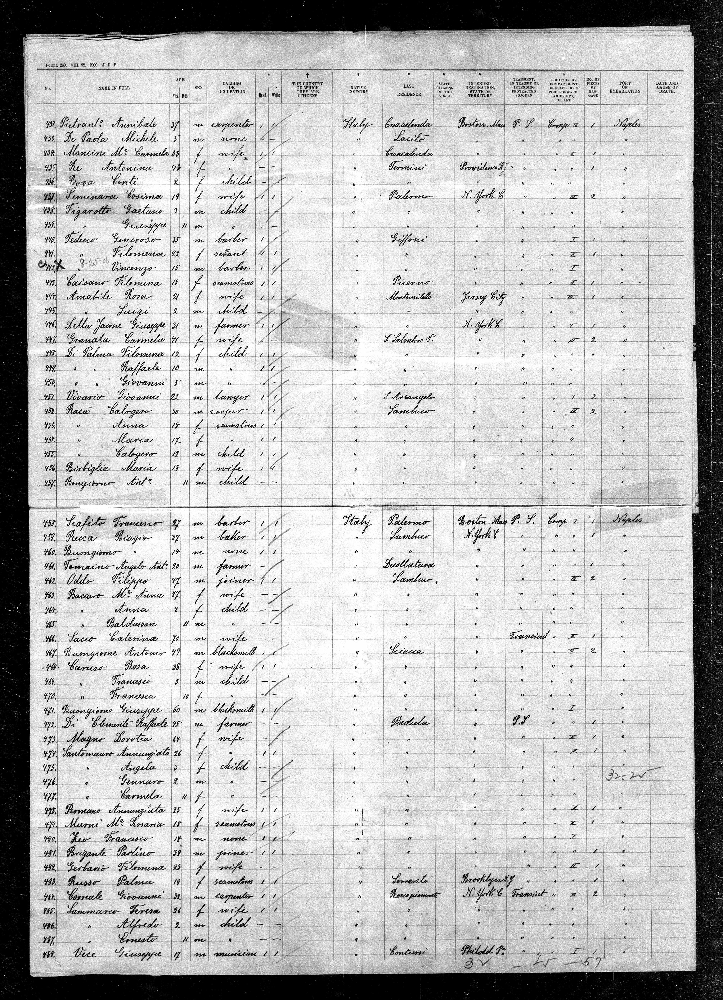
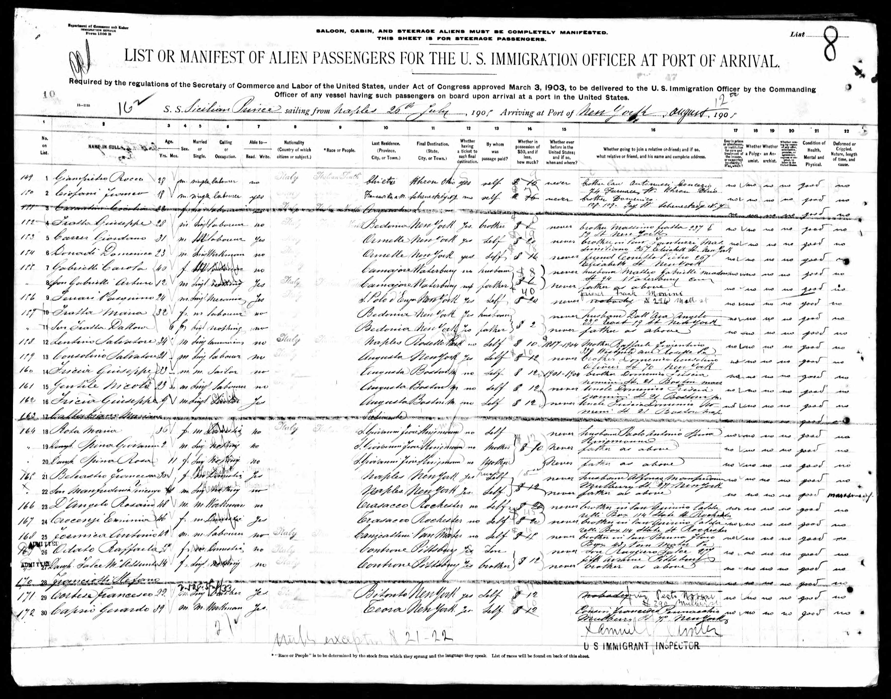

# Sicilians Through Ellis Island and Beyond (1855-1900)

## I. Introduction

I want to design a map that explores Sicilian immigration to the United States in the late 19th-early 20th century.

New York City was a major port of entry for most of US history, with [Castle Garden](https://www.nps.gov/cacl/index.htm), the country's first immigration center, serving from 1855 to 1890. It was replaced by [Ellis Island](https://www.nps.gov/elis/index.htm), which was the main immigrant processing station for the United States from 1892 to 1954. My great-grandfather landed in New York three times (1905, 1912, and 1922)! The ship manifests have lists of passengers, as well as other items such as age, sex, marital status, occupation, and destination depending on the year.

1870 example (Passenger lists of vessels arriving at New York, 1820-1897 ; index to passenger lists of vessels arriving in New York, 1820-1846 : NARA publications M261 and M237 / United States. Immigration and Naturalization Service, accessed via [FamilySearch](https://www.familysearch.org/en/)):  

  

1892 example (New York passenger arrival lists (Ellis Island), 1892-1924 / United States. Immigration and Naturalization Service, accessed via [FamilySearch](https://www.familysearch.org/en/)):  
  
1905 example (New York passenger arrival lists (Ellis Island), 1892-1924 / United States. Immigration and Naturalization Service, accessed via [FamilySearch](https://www.familysearch.org/en/)):

  

My maternal grandmother’s parents were born in Augusta, Sicily, a town on the eastern coast near Syracuse. Like all of Sicily, many people left during this time period in search of a better life. I am interested in where those that left Augusta, or more broadly Sicily, settled in the United States.

My aim is for the user to gain some understanding of the history of immigration to the United States by exploring a small slice of that story.

## II. Methodology

### A. Data

**Data Sources**

- [Italians to America Passenger Data File, 1855 - 1900](https://aad.archives.gov/aad/series-description.jsp?s=4433&cat=GP44&bc=,sl&col=1002) The National Archives has a database of Italian immigrants from transcribed passenger manifests with some demographic data and the passenger's previous residence and final destination.
- [List of the communes in Sicily](https://en.wikipedia.org/wiki/List_of_communes_of_Sicily) from Wikipedia
- Province boundaries for Italy from http://www.diva-gis.org/. I am using modern-day province boundaries.

**Wrangling and analysis process**

- I scraped the passenger and manifest header data using the process documented in jupyter notebook [NARA_scraper.ipynb](NARA_scraper.ipynb), resulting in three passenger data files ([italians_parta.csv](data/italians_parta.csv), [italians_partb.csv](data/italians_partb.csv), and [italans_partc.csv](data/italians_partc.csv)) and [manifest_list_1855_1900.csv](data/manifest_list_1855_1900.csv).  
- In the Jupyter Notebook [Italians_data_exploration.ipynb](Italians_data_exploration.ipynb), I combined the three passenger data files into [italians_to_america.csv](data/italians_to_america.csv). I then used the list of communes in Sicily [communes_sicily.csv](data/communes_sicily.csv) to filter the passengers to only those that reported a last previous residence in Sicily. I did not account for multiple communes with the same name or any now defunct communes in this analysis.

  I then added the province name as a new column by matching with the commune name. Finally, I converted the Manifest ID to be "int" to match the manifest list file and added the manifest header information to the passenger data file.

Example of cleaned data:

|       | **LastName** | **FirstName** |       **Age**        |  **Occupation**  | **Literacy** | **CountryofOrigin** | **CityTownofLastResidence** | **DestinationCityTown** |           **TransitTravelCompartment**            | **ManifestID** | **Province** | **ShipName** |     **Port**     | **Arrival** |
| :---: | :----------: | :-----------: | :------------------: | :--------------: | :----------: | :-----------------: | :-------------------------: | :---------------------: | :-----------------------------------------------: | :------------: | :----------: | :----------: | :--------------: | :---------: |
|   0   |  BUONGIORNO  |    ANTONIO    |          49          |    BLACKSMITH    | READ & WRITE |        ITALY        |           SCIACCA           |        NEW YORK         | Return trip to USA - non US Citizen [Transit];... |     82236      |  Agrigento   |     EMS      |      NAPLES      | 12/29/1892  |
|   1   |  BUONGIORNO  |   GIUSEPPE    |          60          |    BLACKSMITH    | READ & WRITE |        ITALY        |           SCIACCA           |        NEW YORK         | Return trip to USA - non US Citizen [Transit];... |     82236      |  Agrigento   |     EMS      |      NAPLES      | 12/29/1892  |
|   2   |    CARUSO    |   FRANCESCA   | Infant in months: 10 |      INFANT      |      NO      |        ITALY        |           SCIACCA           |        NEW YORK         | Return trip to USA - non US Citizen [Transit];... |     82236      |  Agrigento   |     EMS      |      NAPLES      | 12/29/1892  |
|   3   |    CARUSO    |   FRANCESCO   |          3           | CHILD, YOUNGSTER |      NO      |        ITALY        |           SCIACCA           |        NEW YORK         | Return trip to USA - non US Citizen [Transit];... |     82236      |  Agrigento   |     EMS      |      NAPLES      | 12/29/1892  |
|   4   |    CARUSO    |     ROSA      |          38          |       WIFE       | READ & WRITE |        ITALY        |           SCIACCA           |        NEW YORK         | Return trip to USA - non US Citizen [Transit];... |     82236      |  Agrigento   |     EMS      |      NAPLES      | 12/29/1892  |
|   5   |  ATTANASIO   |   GIUSEPPE    |          21          |     LABORER      |   UNKNOWN    |        ITALY        |           PALERMO           |        NEW YORK         |  Staying in the USA [Transit]; Stowaway [Travel]  |     80591      |   Palermo    |   GOTTARDO   |     ANTWERP      | 11/30/1884  |
|   6   |    CORRAO    |   VINCENZO    |          23          |    CARPENTER     |   UNKNOWN    |        ITALY        |           PALERMO           |        NEW YORK         |  Staying in the USA [Transit]; Stowaway [Travel]  |     80591      |   Palermo    |   GOTTARDO   |     ANTWERP      | 11/30/1884  |
|   7   |   CUBILLO    |    ROSARIO    |          40          |     UNKNOWN      |   UNKNOWN    |        ITALY        |           MESSINA           |        NEW YORK         |  Staying in the USA [Transit]; Stowaway [Travel]  |       63       |   Messina    |    ALESIA    | MESSINA & NAPLES | 04/25/1885  |
|   8   |  DACQUISTO   |    LORENZO    |          22          |    BLACKSMITH    |   UNKNOWN    |        ITALY        |           PALERMO           |        NEW YORK         |  Staying in the USA [Transit]; Stowaway [Travel]  |     80591      |   Palermo    |   GOTTARDO   |     ANTWERP      | 11/30/1884  |
|   9   |    DERASE    |     LUIGI     |       Unknown        |     UNKNOWN      |   UNKNOWN    |        ITALY        |           MESSINA           |        NEW YORK         |  Staying in the USA [Transit]; Stowaway [Travel]  |       63       |   Messina    |    ALESIA    | MESSINA & NAPLES | 04/25/1885  |

 + I aggregated "Final Destination" data to match duplicates in [destinations.ipynb](destinations.ipynb).
 + I added geocoding results from [geocoding.ipynb](geocoding.ipynb) back to the passenger data.  

### B. Map
**Usability Considerations**

**Medium for Delivery**
The final product is a web map accessible via a web browser on desktop and mobile.
- HTML
- CSS (Bootstrap framework and custom styling)
- JavaScript packages
    - Leaflet.js
    - JQuery
    - PapaParse
    - Leaflet.markercluster
    - noUiSlider

**Final Map**

[courtneysimonse.ninja/sicily-immigrants](courtneysimonse.ninja/sicily-immigrants)

## Conclusion
 Ellis Island and its predecessor, Castle Garden, processed many immigrants. Today, over 40% of Americans can trace their roots back to one of these immigrants ([Ellis Island Fact Sheet](https://www.nps.gov/npnh/learn/news/fact-sheet-elis.htm)). I want to design a map that explore emigration from Sicily to the United States because I want to find out what the patterns were, in order to help the map user or audience understand US immigration better.
